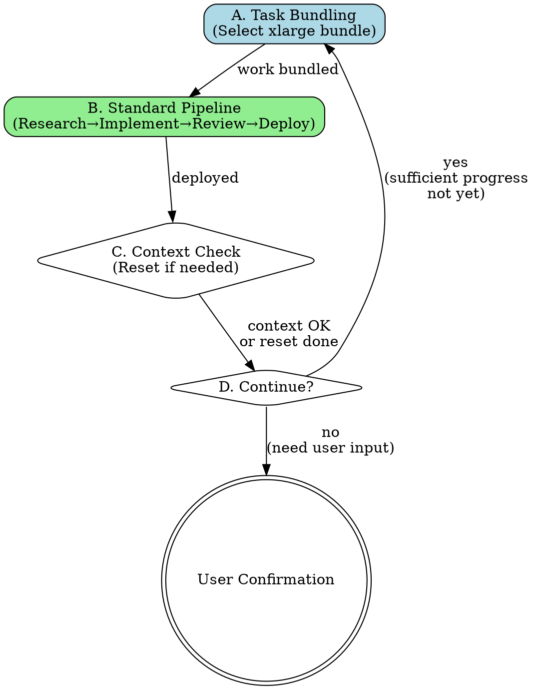
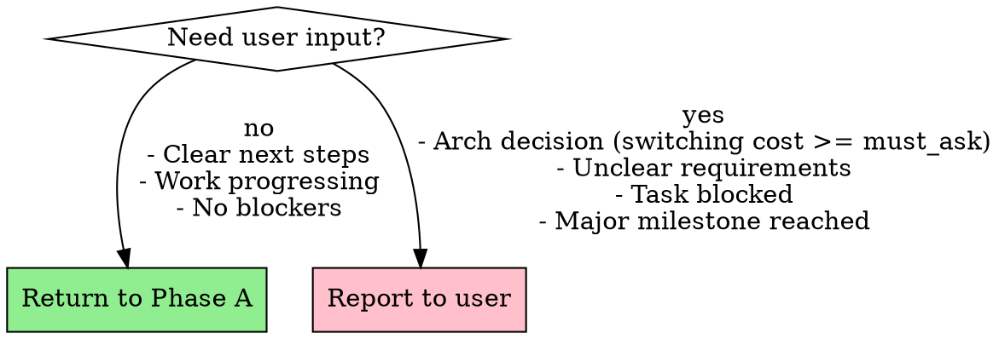

# Autonomous Work Execution

## Overview

**do-work automates the complete development workflow from task selection to deployment, looping autonomously until user input is required.**

Core principle: Bundle xlarge-sized work chunks (expected code change) → Execute with full quality pipeline → Reset context if needed → Repeat.

## Sizing rubric (expected code change, added + deleted)

| Tier   | Lines  | 예시                              |
|--------|--------|-----------------------------------|
| tiny   | ~5     | Config 값, 상수, 문자열 리터럴      |
| small  | ~20    | 한 함수, 한 파일, 로컬 리팩터       |
| medium | ~50    | 여러 파일, 인터페이스 변경           |
| large  | ~100   | 횡단 관심사, 스키마 마이그레이션      |
| xlarge | ~500   | 아키텍처 전환, 프레임워크 교체        |

## Mid-Implementation Switching Cost Thresholds

실행 중 예상치 못한 아키텍처 결정이 발생했을 때 적용한다.

**기본 임계값**: `auto_decide < small(20줄)`, `must_ask >= medium(50줄)`

- AI가 프로젝트 복잡도/리스크에 따라 임계값을 상향/하향 조정 가능
- 예: 프로토타입이면 `auto_decide < medium`으로 완화, 프로덕션 DB 스키마면 `must_ask >= small`로 강화

**알고리즘 (예상치 못한 결정 발생 시):**

```
for each unexpected decision:
  if switching_cost < auto_decide_threshold:
    → 자율 결정 + Auto-Decision Log 기록
  elif switching_cost >= must_ask_threshold:
    → 제네릭 아키텍처로 비용 줄일 수 있는지 확인
      → 줄일 수 있으면: 자율 결정 + 로그
      → 못 줄이면: Phase D로 이동하여 유저에게 질문
  else (gray zone):
    → 제네릭 아키텍처 시도 → 안 되면 자율 결정 + 로그
```

**Auto-Decision Log 포맷 (필수 — 모든 자율 결정에 반드시 작성):**

```markdown
### Auto-Decision Log: [결정 제목]
- **결정**: [선택한 옵션]
- **switching cost**: [tier] (~Y lines)
- **판단 근거**: [3줄 이상 상세 이유]
  - 왜 이 옵션이 최선인지
  - 다른 옵션을 배제한 이유
  - 현재 코드베이스/아키텍처와의 정합성
- **제네릭 패턴 적용**: [있으면 패턴명 + 설명 / 없으면 "불필요"]
- **변경 시 영향**: [나중에 바꾸려면 어디를 고치면 되는지]
```

### Generic Architecture Optimization

제네릭 패턴으로 switching cost를 줄여 자율 결정으로 전환할 수 있다:

| Pattern | 적용 시 switching cost 감소 | 예시 |
|---------|---------------------------|------|
| Interface | large → small | DB 추상화 레이어 뒤에 숨기기 |
| Strategy | medium → tiny | 알고리즘을 교체 가능한 전략으로 |
| Adapter | large → small | 외부 서비스를 어댑터로 감싸기 |
| Config | small → tiny | 하드코딩 대신 설정 파일로 |
| DI | medium → small | 의존성을 주입 가능하게 |

## When to Use

Use when:
- Starting a work session on bd-tracked tasks
- Ready for autonomous multi-hour execution
- Working across p9 and agi project directories
- User wants minimal interruption until confirmation needed

Do NOT use when:
- User asked a single specific question
- Task requires immediate user decision
- Exploring/researching without implementation

## Workflow Phases



### A. Task Bundling (~15min)

**Goal**: Select and prepare a large/xlarge bundle (target xlarge).

```markdown
1. **Survey both projects**
   ```bash
   cd ~/2lab.ai/cco4-persona/p9 && bd ready
   cd ~/2lab.ai/cco4-persona/agi && bd ready
   ```

2. **Prioritize top 3**
   - Analyze urgency, dependencies, impact
   - Update priorities: `bd update <id> --priority P0/P1/P2`

3. **Deep investigation**
   - Read actual code related to each task
   - Update task descriptions with findings
   - `bd update <id> --description "Detailed findings..."`

4. **Select primary task**
   - Choose most critical
   - Explain to user: "I will work on [task] because [detailed reasoning]"
   - Mark in-progress: `bd update <id> --status in_progress`

5. **Validate work bundle (target xlarge)**
   - If below large: Loop back to step 1, add related/next task
   - If above xlarge: Split into multiple bundles
   - If you cannot reach large without unrelated tasks: stop and switch to what-to-work (may route to plan-new-task)
```

**Decision point**: Keep bundling until reaching large/xlarge target; cap at xlarge.

### B. Standard Pipeline (~45-90min per bundle)

**Goal**: Complete the bundled work with full quality checks.

```markdown
1. **Parallel Research** (5-10min)
   Launch simultaneously:
   - Oracle agent: `Task(subagent_type="oh-my-claude:oracle", prompt="Architecture strategy for [task]")`
   - Explore agent: `Task(subagent_type="oh-my-claude:explore", prompt="Find related code for [task]")`

2. **Implementation** (30-60min)
   - Launch opus45 subagent for execution
   - OR implement directly if straightforward
   - **예상치 못한 아키텍처 결정 발생 시** → "Mid-Implementation Switching Cost Thresholds" 참조하여 자율 결정/유저 질문 판별

3. **Code Review Round 1** (5min)
   - Self-review code changes
   - Identify obvious issues

4. **Code Review Round 2** (10min)
   - Oracle (gpt5.2 xlarge): `Task(subagent_type="oh-my-claude:oracle", prompt="Review this implementation for [criteria]")`
   - Address feedback

5. **PR Review Skill** (10min)
   - `Skill(skill="pr-review-toolkit:review-pr")`
   - Resolve all findings

6. **Code Simplification** (5-10min)
   - `Task(subagent_type="code-simplifier:code-simplifier")`
   - Apply simplifications

7. **Quality Gates** (5min)
   ```bash
   bun test        # or npm test / pytest
   bun run build   # if applicable
   bun run lint
   bun run fmt     # or prettier
   ```

8. **Deploy & Review Gate** (2min)
   - Commit with detailed message
   - Push to remote
   - Mark review: `bd set-state <id> phase=review --reason "구현 요약"`
   - **Do NOT `bd close` yet** — wait for review pass

9. **Review Pass → Close with Evidence**
   - Collect evidence from steps 3-7:
     - Test results (pass count, new failures)
     - Build status (tsc clean / errors)
     - Code review agent feedback (addressed / outstanding)
     - Change scope (files count, lines added/removed)
   - Close with evidence:
     ```bash
     bd close <id> --reason "tsc clean, vitest 423 passed (0 new), Oracle reviewed, 5 files +491 lines"
     ```
   - **NEVER** close with vague reasons like "done" or "구현 완료"
```

**Critical**: Do NOT skip steps under time pressure.
**Critical**: NEVER `bd close` without going through `phase=review` first.
**Critical**: NEVER `bd close` without concrete evidence in `--reason`.

### C. Context Management (~2min)

**Goal**: Prevent context overflow breaking the session.

```markdown
Check current context usage (look for warnings)

IF context > 70%:
  1. Save critical state to files
  2. Use `/compact` or similar context compression
  3. OR end session gracefully and document resume point

ELSE:
  Continue to Phase D
```

### D. Loop Decision (~1min)

**Goal**: Decide if autonomous work can continue.



**Stop and ask user if:**
- switching_cost >= must_ask AND 제네릭 아키텍처로 줄일 수 없는 경우만
- Requirements unclear or ambiguous
- Task is blocked (waiting for external input)
- Major milestone reached (user should review)
- Work session feels "complete enough"

**Do NOT stop for:**
- switching_cost < auto_decide → 자율 결정 + Auto-Decision Log
- 제네릭 패턴(Interface/Strategy/Adapter/Config/DI)으로 switching cost를 줄일 수 있는 결정

**Continue autonomously if:**
- Next task is clear from bd ready
- All requirements understood
- No blockers
- Haven't reached natural stopping point
- 아키텍처 결정이 있더라도 switching_cost < must_ask이면 자율 처리

## Integration with Other Skills

**REQUIRED during Phase B:**
- `oh-my-claude:oracle` - Architecture decisions
- `oh-my-claude:explore` - Code investigation
- `pr-review-toolkit:review-pr` - Quality gate
- `code-simplifier:code-simplifier` - Code cleanup

**RECOMMENDED:**
- `superpowers:verification-before-completion` - Before claiming done
- `superpowers:systematic-debugging` - If issues found

**FRAMEWORK:**
- `new-task` switching cost 프레임워크 — 5-tier sizing, 임계값 시스템, Auto-Decision Log, Generic Architecture Optimization 공유

## Working Directory Awareness

```bash
# Always check BOTH project directories
~/2lab.ai/cco4-persona/p9/     # bd for p9 issues
~/2lab.ai/cco4-persona/agi/    # bd for agi issues
```

Use `bd ready` in each directory, prioritize across both.

## Common Mistakes

| Mistake | Fix |
|---------|-----|
| Bundling < 30min work | Loop back to Phase A, add related tasks |
| Skipping code review steps | All review steps are mandatory |
| `bd close` without `phase=review` | Always `bd set-state <id> phase=review` first, then close after review |
| Continuing when blocked | Stop at Phase D, ask user |
| Forgetting context check | Check every cycle, compress proactively |
| Single-project focus | MUST check both p9 and agi |
| tiny switching cost에 멈춤 | auto-decide + Auto-Decision Log 작성 |
| 자율 결정했는데 로그 안 남김 | 모든 자율 결정에 Auto-Decision Log 필수 |

## Red Flags - STOP Immediately

These thoughts mean you're about to violate workflow:

- "Code review seems overkill for this small change"
- "I'll skip tests, it's obvious this works"
- "User probably doesn't need to know about this decision"
- "Let me just quickly fix this without the pipeline"
- "Phase A is taking too long, let me just start coding"
- "I'll just bd close, the code looks fine"
- "bd close --reason 'done'" (vague = violation)
- "이 결정은 복잡하니 유저한테 물어보자" (switching cost 확인 먼저)
- "로그는 나중에 써도 되지" (결정 시점에 즉시 Auto-Decision Log 작성)

**All of these mean: Follow the workflow. No shortcuts.**

## Quality Expectations

**Phase A output:**
- Clear explanation of selected work to user
- Updated bd issue descriptions
- Realistic size estimate (tiny/small/medium/large/xlarge)

**Phase B output:**
- All tests passing
- All quality gates passed (lint, fmt, build)
- Code reviewed by Oracle
- PR review completed
- Simplified and clean
- Committed and pushed
- `bd set-state <id> phase=review` (then `bd close` after review pass)
- 실행 중 자율 결정이 있었다면 Auto-Decision Log 포함

**Phase D decision:**
- Explicit reasoning documented
- If stopping: clear resume point for next session
- stopping 시 switching cost 평가 포함 (왜 must_ask인지, 제네릭 패턴 검토 결과)

## Session Context

This workflow runs in YOUR current context (not subagent).

- You maintain conversation history with user
- You see cumulative progress
- You manage context limits
- You decide when to loop vs stop

**Context budget**: Aim for 3-4 Phase A→B→C→D cycles per session before needing reset.

## Real-World Impact

**Without do-work:**
- 30min+ per task on workflow overhead
- Inconsistent quality (skip steps under time pressure)
- Frequent context switches lose momentum
- User interrupts break flow

**With do-work:**
- 3-5 hours continuous autonomous work
- Consistent quality pipeline every task
- Natural stopping points for user input
- Momentum maintained across tasks

**Measured benefit**: ~40% time savings from batching overhead, 90% quality consistency.
