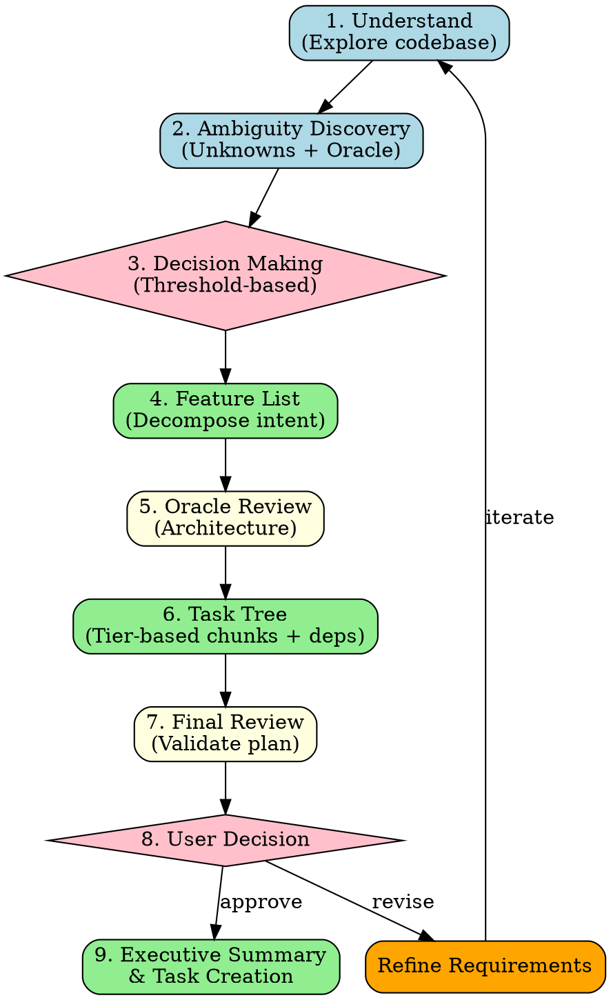

# New Task Decomposition

## Overview

**new-task transforms vague user requirements into structured bd task trees with dependencies, estimated effort, and architectural decisions resolved upfront.**

Core principle: Understand intent deeply → Build comprehensive plan → Get architectural decisions → Create task tree → Confirm before execution.

## When to Use

Use when:
- User describes feature/idea in vague or high-level terms
- Need to decompose work into bd-trackable tasks
- Architectural decisions required before implementation
- Multiple implementation approaches possible
- Work estimate >2 hours (needs task breakdown)

Do NOT use when:
- User request is already specific (1-2 file changes)
- Fixing obvious bug with clear solution
- Task already exists in bd (use existing workflow)
- Quick clarification or simple question

## Switching Cost Metrics

### Size Tiers

| Tier   | Lines  | 예시                              |
|--------|--------|-----------------------------------|
| tiny   | ~5     | Config 값, 상수, 문자열 리터럴      |
| small  | ~20    | 한 함수, 한 파일, 로컬 리팩터       |
| medium | ~50    | 여러 파일, 인터페이스 변경           |
| large  | ~100   | 횡단 관심사, 스키마 마이그레이션      |
| xlarge | ~500   | 아키텍처 전환, 프레임워크 교체        |

### Flexible Threshold System

**기본 임계값**: `auto_decide < small(20줄)`, `must_ask >= medium(50줄)`

- AI가 프로젝트 복잡도/리스크에 따라 임계값을 상향/하향 제안 가능
- 예: 프로토타입이면 `auto_decide < medium`으로 완화, 프로덕션 DB 스키마면 `must_ask >= small`로 강화
- Phase 1 완료 후 프로젝트 컨텍스트를 보고 임계값을 제안하고, 유저가 조정 가능

## Workflow Phases



## Phase Details

### Phase 1: Understand Codebase (~10min)

**Goal**: Ground the request in actual project structure.

```markdown
1. **Identify relevant directories/files**
   - Use Explore agent: `Task(subagent_type="oh-my-claude:explore", prompt="Find code related to [user's topic]")`
   - Grep for keywords from user request
   - Check existing similar features

2. **Understand current architecture**
   - Read key files (main entry points, config, types)
   - Identify patterns used (DDD, MVC, etc.)
   - Note tech stack, dependencies

3. **Document findings**
   - Existing related features
   - Current architecture patterns
   - Potential integration points
```

### Phase 2: Ambiguity Discovery & Oracle Research (~15min)

**Goal**: 요구사항의 모호한 점을 모두 찾고, 각각에 대해 옵션을 리서치한다.

```markdown
1. **모호성 전체 추출**
   - 유저 요구사항에서 구현 방법이 2가지 이상 가능한 모든 지점 나열
   - "이걸 어떻게 구현하지?"가 떠오르는 모든 부분
   - 기술 선택, 아키텍처 패턴, 데이터 모델, API 설계 등

2. **Oracle 리서치 (각 모호성마다)**
   - Task(subagent_type="oh-my-claude:oracle") 호출하여 2~3개 옵션 리서치
   - 각 옵션의 장단점, 적합한 상황, 제약사항 조사
   - Context7/WebSearch로 라이브러리별 최신 패턴 확인

3. **Ambiguity Table 작성**

   | # | 모호성 | Option A | Option B | Option C |
   |---|--------|----------|----------|----------|
   | 1 | [제목] | [설명]   | [설명]   | [설명]   |
   |   |        | 작업량: [tier] | 작업량: [tier] | 작업량: [tier] |
   |   |        | switching cost: [tier] | switching cost: [tier] | switching cost: [tier] |
   |   |        | 제네릭 패턴: [Y/N] | 제네릭 패턴: [Y/N] | 제네릭 패턴: [Y/N] |

   - 작업량(tier): 해당 옵션을 구현하는 데 필요한 코드 라인수 tier
   - switching cost(tier): 나중에 다른 옵션으로 바꿀 때 필요한 코드 변경량 tier
   - 제네릭 패턴: Interface/Strategy/Adapter 등으로 switching cost를 줄일 수 있는지
```

### Phase 3: Decision Making — Threshold-Based (~10min)

**Goal**: 임계값 기반으로 자율 결정 vs 유저 질문을 판별한다.

```markdown
**알고리즘 (각 ambiguity에 대해):**

for each ambiguity:
  if switching_cost < auto_decide_threshold:
    → 자율 결정 + 상세 판단 로그 기록
  elif switching_cost >= must_ask_threshold:
    → 제네릭 아키텍처로 비용 줄일 수 있는지 확인
      → 줄일 수 있으면: 자율 결정 + 로그
      → 못 줄이면: 유저에게 질문
  else (gray zone):
    → 제네릭 아키텍처 시도 → 안 되면 자율 결정 + 로그

**자율 결정 로그 포맷 (필수 — 모든 자율 결정에 반드시 작성):**

### Auto-Decision Log: [Ambiguity #N] [제목]
- **결정**: Option [X] 선택
- **switching cost**: [tier] (~Y lines)
- **판단 근거**: [3줄 이상 상세 이유]
  - 왜 이 옵션이 최선인지
  - 다른 옵션을 배제한 이유
  - 현재 코드베이스/아키텍처와의 정합성
- **제네릭 패턴 적용**: [있으면 패턴명 + 설명 / 없으면 "불필요"]
- **변경 시 영향**: [나중에 바꾸려면 어디를 고치면 되는지]

**유저 질문은 3개 이하로 제한:**
- 제네릭 아키텍처를 적극 활용하여 질문 수를 줄일 것
- 5개 이상 질문해야 할 것 같으면, 제네릭 패턴으로 switching cost를 줄여 자율 결정으로 전환
```

### Phase 4: Feature List Decomposition (~10min)

**Goal**: Break intent into concrete, implementable features.

```markdown
Create bulleted list of all features needed:

**Example** (for "add authentication"):
- User registration flow
- Login/logout endpoints
- Session management
- Password hashing
- Token generation/validation
- Protected route middleware
- User profile CRUD
- Password reset flow
- Rate limiting for auth endpoints

Group related features, note dependencies
```

### Phase 5: Oracle Architecture Review (~10min)

**Goal**: Get expert review on architectural approach.

```markdown
Launch Oracle with context:

Task(subagent_type="oh-my-claude:oracle", prompt="""
Review this feature plan for architectural soundness:

User Request: [original request]
Feature List: [from Phase 4]
Current Architecture: [from Phase 1]

Questions:
1. Is this approach sound for the existing codebase?
2. What design patterns should be used?
3. What are critical architectural decisions?
4. What could go wrong?
5. Alternative approaches?
""")

Document Oracle's feedback, update feature list if needed.
```

### Phase 6: Task Tree Creation (~20min)

**Goal**: Convert features into tier-based bd tasks with dependencies.

```markdown
**Task Breakdown Rules:**
- Each task = small~medium tier (20~50줄)
- If >medium: split into subtasks
- If <small: combine with related task

**For each feature:**
1. Estimate total effort
2. Split into small~medium tier chunks
3. Identify dependencies (blocks/blocked-by)
4. Assign priority (P0/P1/P2)

**Task Format:**
```
[ID] Task Title [Priority] [Estimate]
Description: What needs to be done
Dependencies: [ID1], [ID2] (if any)
Acceptance Criteria: How to verify complete
```

**Example Tree:**
```
auth-1: Setup authentication schema [P0] [1h]
  ↓ blocks
auth-2: Implement password hashing [P0] [1h]
  ↓ blocks
auth-3: Create register endpoint [P0] [1.5h]
auth-4: Create login endpoint [P0] [1h]
  ↓ blocks
auth-5: Add session middleware [P1] [1h]
  ↓ blocks
auth-6: Protect existing routes [P1] [2h]
```
```

### Phase 7: Final Review (~5min)

**Goal**: Validate the entire plan before presenting to user.

```markdown
Self-review checklist:
- [ ] All features from Phase 4 covered?
- [ ] Task estimates realistic (small~medium tier)?
- [ ] Dependencies correctly identified?
- [ ] Priorities make sense (P0 = critical path)?
- [ ] Acceptance criteria clear?
- [ ] No orphan tasks (all connected)?
- [ ] Phase 3 자율 결정 로그가 모두 포함되어 있는지?

Oracle review (optional if major changes):
Task(subagent_type="oh-my-claude:oracle", prompt="Validate this task tree for completeness and dependencies: [task tree]")
```

### Phase 8: User Decision (~5-10min)

**Goal**: Get architectural decisions and final approval.

```markdown
**Present to User:**

"## Feature Plan: [Title]

### Overview
[2-3 sentence summary of what will be built]

### Features
[Bulleted list from Phase 4]

### Auto-Decision Log
[Phase 3에서 자율 결정한 항목들의 로그 전체 포함]

### Task Breakdown
[Show task tree with estimates and dependencies]
Total Effort: [tier별 추정 라인수 합산]

### Architectural Decisions Required

[Phase 3에서 must_ask으로 분류된 항목만 — 3개 이하]

**Example:**
1. **Authentication Method** (switching cost: large ~100줄)
   - Option A: JWT tokens (stateless, scales better)
   - Option B: Session cookies (simpler, server-side state)
   - Recommendation: [A/B with reasoning]

2. **Storage** (switching cost: xlarge ~500줄)
   - Option A: PostgreSQL (relational, ACID)
   - Option B: MongoDB (flexible schema)
   - Recommendation: [A/B with reasoning]

### Next Steps
Reply:
- 'Approve' to create tasks and start
- 'Change X to Y' to revise decisions
- 'Add/Remove Z' to adjust scope
"

**Handle Response:**
- "Approve" → Phase 9 (Executive Summary)
- Revisions → Update plan, return to Phase 8
- Scope changes → Return to Phase 4
```

### Phase 9: Executive Summary & Task Creation (~10min)

**Goal**: Finalize plan and create bd tasks.

```markdown
1. **Create bd tasks**
   ```bash
   cd [project-dir]

   # Create tasks with dependencies
   bd create --title "[Task]" --type task --priority P0 \
     --description "[detailed description]" \
     --depends-on [parent-task-id]
   ```

2. **Generate Executive Summary**

   "## Executive Summary: [Feature Name]

   ### Scope
   - [X] tasks created
   - [Y] hours estimated effort
   - [Z] critical path items (P0)

   ### Architecture Confirmed
   - [Decision 1]: [Choice made]
   - [Decision 2]: [Choice made]

   ### Task Tree
   [Visual dependency tree]

   ### Critical Path
   [P0 tasks in execution order]

   ### Ready to Execute
   Use `do-work` to begin implementation, starting with:
   [First task ID and title]
   "

3. **Ready for execution**
   - All tasks in bd
   - Dependencies set
   - User can start `do-work` immediately
```

## Integration with Other Skills

**REQUIRED:**
- `oh-my-claude:oracle` - Ambiguity research (Phase 2), Architecture review (Phase 5, 7)
- `oh-my-claude:explore` - Codebase understanding (Phase 1)

**RECOMMENDED:**
- `oh-my-claude:librarian` - External docs research (Phase 2)
- `superpowers:brainstorming` - If user request very vague

**SEQUENTIAL:**
After new-task completes → Use `do-work` for execution

## Decision Guidelines

### What to Ask User (switching cost >= medium, ~50줄+)

| Category | Ask? | Tier | Example |
|----------|------|------|---------|
| Data model | ✅ Yes | large~xlarge | SQL vs NoSQL, schema design |
| Architecture pattern | ✅ Yes | large~xlarge | Microservices vs monolith, event-driven |
| Major dependencies | ✅ Yes | medium~large | Choose between libraries A vs B |
| Security approach | ✅ Yes | large | OAuth provider, encryption method |
| Deployment model | ✅ Yes | xlarge | Serverless vs VPS, CDN strategy |

### What NOT to Ask (switching cost < small, ~20줄 이하)

| Category | Don't Ask | Tier | Why |
|----------|-----------|------|-----|
| Naming | Variable/function names | tiny | Refactorable in minutes |
| File structure | Where to put files | small | Easy to reorganize |
| UI styling | Colors, spacing | tiny | Cosmetic, quick to change |
| Error messages | Exact wording | tiny | Trivial updates |
| Config values | Timeout, limits | tiny | Environment variables |

### Generic Architecture Optimization

제네릭 패턴으로 switching cost를 줄여 자율 결정으로 전환할 수 있다:

| Pattern | 적용 시 switching cost 감소 | 예시 |
|---------|---------------------------|------|
| Interface | large → small | DB 추상화 레이어 뒤에 숨기기 |
| Strategy | medium → tiny | 알고리즘을 교체 가능한 전략으로 |
| Adapter | large → small | 외부 서비스를 어댑터로 감싸기 |
| Config | small → tiny | 하드코딩 대신 설정 파일로 |
| DI | medium → small | 의존성을 주입 가능하게 |

**Rule of Thumb**: switching cost < small(20줄)이면 자율 결정. 임계값은 프로젝트 컨텍스트에 따라 조정 가능.

## Common Mistakes

| Mistake | Fix |
|---------|-----|
| Skipping Phase 1 | Always explore codebase first - grounds plan in reality |
| Tasks >medium tier | Split further - easier to track and estimate |
| Missing dependencies | Review task tree for orphans and cycles |
| Asking trivial questions | switching cost < small이면 자율 결정 |
| No acceptance criteria | Every task needs "how to verify done" |
| Creating tasks immediately | Complete all phases first, then create |
| 자율 결정했는데 로그 안 남김 | 모든 자율 결정에 반드시 상세 로그 (Phase 3 포맷) |
| 임계값 고정으로만 생각 | 프로젝트 컨텍스트에 맞게 유연하게 조정 |
| 제네릭 아키텍처 검토 안 함 | 유저에게 묻기 전에 반드시 제네릭 패턴으로 switching cost 줄일 수 있는지 확인 |
| 유저에게 5개 이상 질문 | 3개 이하로 줄이도록 제네릭 아키텍처 활용 |

## Red Flags - STOP

These thoughts mean you're skipping steps:

- "Let me just create a few tasks quickly"
- "I know what they want, don't need Phase 2"
- "Oracle review seems overkill"
- "This is too simple for a task tree"
- "Let me ask user about file naming"
- "자율 결정 로그는 나중에 써도 되겠지"
- "제네릭 패턴 안 써도 유저한테 물어보면 되지"

**All of these mean: Follow the workflow. All phases.**

## Quality Expectations

**Phase 1 output:**
- 3-5 key files identified
- Current architecture pattern documented
- Integration points noted
- 프로젝트 컨텍스트에 맞는 임계값 제안

**Phase 2 output:**
- 모든 모호성 추출 (누락 없이)
- 각 모호성마다 2~3개 옵션 + tier 평가
- Ambiguity Table 완성

**Phase 3 output:**
- 모든 자율 결정에 상세 로그 포함
- 유저 질문 3개 이하
- 제네릭 아키텍처 검토 흔적 명시

**Phase 4 output:**
- 5-15 features listed (if <5, may be too simple; if >15, split into epics)
- Features grouped by domain
- Dependencies between features noted

**Phase 6 output:**
- All tasks small~medium tier
- Clear dependency tree (no cycles)
- Priorities assigned (P0 = critical path)
- Acceptance criteria for each

**Phase 8 output:**
- Auto-Decision Log 포함
- 3개 이하 architectural decisions presented
- Recommendation for each with reasoning
- Trade-offs explicitly stated

**Phase 9 output:**
- All bd tasks created with dependencies
- Executive summary <300 words
- User knows exactly what to do next

## Real-World Impact

**Without new-task:**
- 30min+ clarifying vague requests
- Missed dependencies discovered mid-implementation
- Rework due to wrong architectural choices
- Unclear scope, effort estimates

**With new-task:**
- 60-90min upfront planning
- Clear task tree with dependencies
- Architectural decisions made before coding
- Accurate effort estimates
- User confidence in plan

**Measured benefit**: ~3x reduction in mid-implementation surprises, 2x better effort estimates.
